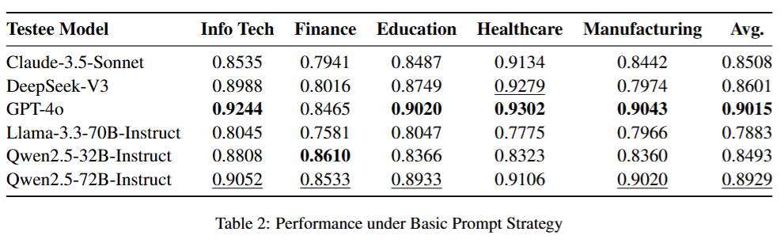

<h1 align="center">
    GuessArena: Guess Who I Am? A Self-Adaptive Framework for Evaluating LLMs in Domain-Specific Knowledge and Reasoning
</h1>

GuessArena is an adaptive evaluation framework based on adversarial gaming mechanisms. Inspired by the interactive structure of the Guess Who I Am? game, our framework integrates dynamic knowledge modeling with progressive reasoning assessment to enhance evaluation fidelity. Empirical studies across five vertical domains—finance, healthcare, manufacturing, information technology, and education—demonstrate that GuessArena effectively differentiates LLMs in terms of domain knowledge coverage and reasoning chain completeness. Compared to traditional benchmarks, our approach offers significant advantages in interpretability and scenario adaptability.

<p align="center"></p>

## Highlights
- First interactive reasoning-based domain-adaptive evaluation framework: We formalize the game mechanics of "Guess Who I Am" into a two-stage paradigm consisting of dynamic knowledge modeling and progressive reasoning assessment, effectively unifying domain knowledge testing and complex reasoning evaluation within a single framework.
- Adaptive card extraction algorithm for domain knowledge: We develop an algorithm that automatically extracts structured evaluation cards from unstructured documents (e.g., PDF, HTML, Text) relevant to the target assessment scenario, significantly reducing the cost of constructing domain-specific testing pipelines.
- Comprehensive applicability assessment across five key industries: We evaluate GuessArena on leading LLM architectures in finance, healthcare, manufacturing, information technology, and education. Additionally, we open-source the entire evaluation framework and benchmark dataset for the research community.

## Quick Start
```
# Install dependencies
conda create -n guessarena python=3.10
conda activate guessarena
pip install -r requirements.txt

# Set up configuration
mv models_example.ini models_example.ini
# Edit models_example.ini to add your API key

# Build the deck
python cli.py build_deck --gen_model GPT_4o --topic info_tech --gen_max_keywords_per_doc 100

# Run the eval
python cli.py eval --tester_model GPT_4o --testee_model GPT_4o --topic info_tech --prompt_strategy basic --verbose --num_cards 10 --random_seed 42

# Run the stats
python cli.py stats
```

## Project Structure
```
.
├── README.md                  # Project description and documentation
├── cli.py                      # Command line interface script to handle user input and start the project
├── configs                     # Configuration files directory containing model and document configuration
│   ├── ind_docs.ini            # Industry documents configuration file
│   ├── models.ini              # Model configuration file
│   └── models_example.ini      # Example model configuration file
├── demo.ipynb                  # Jupyter notebook example demonstrating how to use the project
├── docs                        # Directory containing industry data documents
│   ├── education               # Education-related documents
│   ├── finance                 # Finance-related documents
│   ├── healthcare              # Healthcare-related documents
│   ├── info_tech               # Information technology-related documents
│   └── manufacturing           # Manufacturing-related documents
├── outputs                     # Output results directory
│   ├── kbg-files               # Generated knowledge background files
│   │   ├── education_kbg.txt   # Knowledge background for the education domain
│   │   ├── finance_kbg.txt     # Knowledge background for the finance domain
│   │   ├── healthcare_kbg.txt  # Knowledge background for the healthcare domain
│   │   ├── info_tech_kbg.txt   # Knowledge background for the information technology domain
│   │   └── manufacturing_kbg.txt # Knowledge background for the manufacturing domain
│   ├── overall                 # Overall evaluation results
│   ├── run_logs                # Run logs directory
│   ├── stats                   # Statistics directory
│   └── testsets                # Test sets directory
│       ├── education_30.txt    # Education domain test set
│       ├── finance_30.txt      # Finance domain test set
│       ├── healthcare_30.txt   # Healthcare domain test set
│       ├── info_tech_30.txt    # Information technology domain test set
│       └── manufacturing_30.txt # Manufacturing domain test set
├── packs                       # Directory for additional models or data packs
├── prompts                     # Directory for prompt templates used to generate evaluation tasks
│   ├── basic_testee_system.txt # Basic testee system prompt template
│   ├── cot_testee_system.txt   # Chain-of-thought testee system prompt template
│   ├── gen_kbg.txt             # Prompt template for generating knowledge background
│   ├── gen_kws_deck.txt        # Prompt template for generating keyword decks
│   ├── know_testee_system.txt  # Knowledge-driven testee system prompt template
│   └── tester_system.txt       # Tester system prompt template
├── requirements.txt            # Project dependencies file
└── src                         # Source code directory
    ├── __init__.py             # Package initialization file
    ├── build                   # Build module, containing code related to card creation
    │   ├── __init__.py         # Build module initialization file
    │   ├── deck_builder.py     # Script for building the keyword deck
    │   └── keyword_filter.py   # Script for filtering keywords
    ├── eval                    # Evaluation module, containing code related to the game and evaluation
    │   ├── __init__.py         # Evaluation module initialization file
    │   ├── game_runner.py      # Script for running the evaluation game
    │   └── guess_game.py       # Script for conducting the guess game
    └── utils                   # Utility module, containing helper functions
        ├── __init__.py         # Utility module initialization file
        ├── kbg_gen.py          # Script for generating knowledge backgroud
        └── stats.py            # Script for statistics and data analysis
```

## Results
<p align="center"></p>
