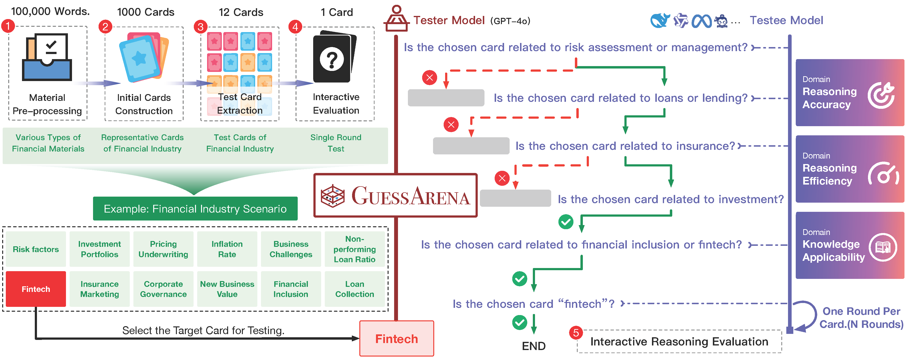

<h1 align="center">
    GuessArena: Guess Who I Am? A Self-Adaptive Framework for Evaluating LLMs in Domain-Specific Knowledge and Reasoning
</h1>


<p align="center">
    <a href="https://arxiv.org/abs/2505.22661">
        
    </a>
    <a href="https://opensource.org/license/apache-2-0">
        
    </a>
    <a href="https://github.com/IAAR-Shanghai/GuessArena">
        
    </a>
</p>


> \[!NOTE\]
>
> 🌟 Love GuessArena? Star our project on GitHub to get instant updates and show your support!


## 🗺️ Overview

<div align="center">
    
</div>

<details><summary>Abstract</summary>
The evaluation of large language models (LLMs) has traditionally relied on static benchmarks, a paradigm that poses two major limitations: (1) predefined test sets lack adaptability to diverse application domains, and (2) standardized evaluation protocols often fail to capture fine-grained assessments of domain-specific knowledge and contextual reasoning abilities. To overcome these challenges, we propose GuessArena, an adaptive evaluation framework grounded in adversarial game-based interactions. Inspired by the interactive structure of the Guess Who I Am? game, our framework seamlessly integrates dynamic domain knowledge modeling with progressive reasoning assessment to improve evaluation fidelity. Empirical studies across five vertical domains—finance, healthcare, manufacturing, information technology, and education—demonstrate that GuessArena effectively distinguishes LLMs in terms of domain knowledge coverage and reasoning chain completeness. Compared to conventional benchmarks, our method provides substantial advantages in interpretability, scalability, and scenario adaptability.
</details>

The key contributions of GuessArena are as follows:

- **Interactive, Reasoning-Based, Domain-Adaptive Evaluation Framework**: GuessArena formalizes the mechanics of the *Guess Who I Am?* game into a two-stage paradigm—dynamic knowledge modeling and progressive reasoning assessment—seamlessly integrating domain knowledge testing and complex reasoning evaluation within a unified framework.

- **Adaptive Card Extraction Algorithm**: GuessArena includes an algorithm that automatically extracts structured evaluation cards from unstructured documents (e.g., PDF, HTML, plain text) relevant to the target domain, significantly reducing the cost and effort of building domain-specific evaluation pipelines.

- **Comprehensive Evaluation Across Five Key Industries**: GuessArena demonstrates its applicability by evaluating state-of-the-art LLMs in finance, healthcare, manufacturing, information technology, and education. The entire evaluation framework and benchmark dataset are open-sourced to facilitate future research.


## ⚙️ Installation

- Clone the repository:

```bash
$ git clone https://github.com/IAAR-Shanghai/GuessArena.git
$ cd GuessArena
```

- Create a virtual environment:

```bash
$ conda create -n guessarena -y python=3.10
$ conda activate guessarena
```

- Install the required packages:

```bash
$ pip install -r requirements.txt
```

- Set up the models config file:

```bash
$ mv models_example.ini models.ini
$ vim models.ini # Edit the file to configure the models you want to use
```

## 🚀 Usage

### Evaluate with Predefined Domains

- Download the predefined datasets from Google Drive:
> GuessArena provides predefined datasets for five key domains: finance, healthcare, manufacturing, information technology, and education. You can download these datasets from Google Drive. The datasets include domain-specific documents, card packages, and test sets that are ready to use for evaluation.

```bash
$ wget https://drive.google.com/uc?id=1ZJdb8UJZRlnceYDkGKv5Hc_LxZ3T8hR_ -O predefined_domains.zip
$ unzip predefined_domains.zip -d data
```

- Run the build script to prepare the evaluation cards:

```bash
$ python cli.py build_deck --gen_model GPT-4o --topic info_tech --gen_max_keywords_per_doc 100
```

- Run the evaluation script for predefined domains:

```bash
$ python cli.py eval --tester_model GPT-4o --testee_model GPT-4o --topic info_tech --prompt_strategy basic --verbose --num_cards 30 --random_seed 42
```

- Run the statistics script to analyze the evaluation results:

```bash
$ python cli.py stats
```

### Evaluate with Custom Domains
> GuessArena allows you to evaluate LLMs in custom domains by creating your own evaluation cards based on domain-specific documents. This enables you to assess LLMs in areas that are not covered by the predefined domains.

- Place your custom domain documents (PDF, HTML, or text files) in the `data/documents/your_custom_domain` directory.

> Run the build script to prepare the evaluation cards for your custom domain:

```bash
$ python cli.py build_deck --gen_model GPT-4o --topic your_custom_domain --gen_max_keywords_per_doc 100
```

- Alternatively, you can create a custom test set file in `data/testsets/your_custom_domain.txt` with the following format:

```json
[
    "keyword1",
    "keyword2",
    "keyword3",
    "...",
    "keywordN"
]
```

- Run the evaluation script for your custom domain:

```bash
$ python cli.py eval --tester_model GPT-4o --testee_model GPT-4o --topic your_custom_domain --prompt_strategy basic --verbose --num_cards 30 --random_seed 42
```

### Run with YAML Configuration

> You can also run the card generation and evaluation using a YAML configuration file. Refer to `scripts/example.yaml` for an example configuration file, and then run the following command:

```bash
$ python cli.py run --config scripts/example.yaml
```

## 📄 Citation

```

```
